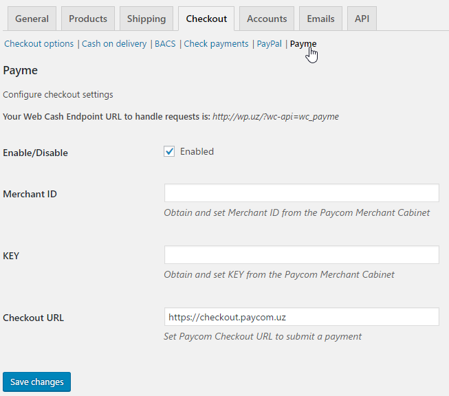

# WooCommerce plugin for Payme

## Установка

#### Требования

- PHP >= 5.4
- [WordPress 4.x](https://wordpress.org/)
- [WooCommerce 3.x](https://woocommerce.com/)
- Регистрация в кабинете поставщика [Paycom](http://paycom.uz/)

#### GitHub

Скачайте плагин как [ZIP архив](https://github.com/PaycomUZ/woocommerce-payment-gateway/releases/latest)

Загрузите плагин в WordPress


...и установите его


Активируйте плагин после установки


#### Что бы Apache не игнорировал заголовок `Authorization` надо загрузить файл `.htaccess` со следующем содержанием:

```
RewriteEngine On
RewriteCond %{HTTP:Authorization} ^(.*)
RewriteRule .* - [e=HTTP_AUTHORIZATION:%1]
```

в корневую директорию сайта

Откройте страницу настроек WooCommerce


Откройте вкладку `Checkout`


Откройте вкладку `Payme` и внесите необходимые данные.



Скопируйте ваш `Endpoint URL` и внесите его в кабинете поставщика Paycom.


## Фискализация

Для того что-бы самому отправлять фискальные данные, ван нужно будет включить эту функцию в настройках плагина.


В настройках товара в разделе `Данные товара`, во вкладке `Основные`, вы увидите 3 поля, которые нужно будет заполнить.

